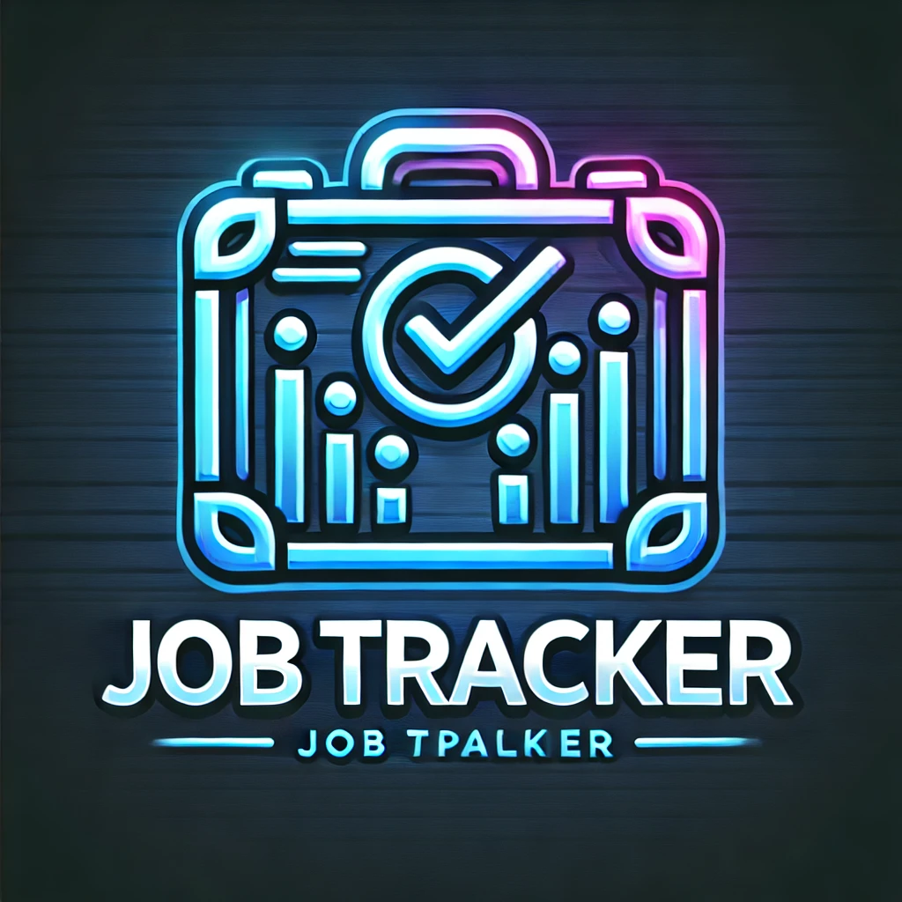

<p align="center">
  
</p>

# Job Tracker App 🚀

## Overview
Job Tracker is a **feature-rich web application** designed to streamline job application tracking, **schedule interviews**, and manage job search progress effectively. The platform offers a **Kanban board**, **Google Calendar integration**, **job listing APIs**, and **Firebase authentication** for a seamless user experience.

---

## 🔥 Key Features
✅ **Secure Authentication** – Google Sign-in via Firebase (`firebase.js`).  
✅ **Kanban Board** – Organize applications through different stages (`dashboard.html`).  
✅ **Job Search Integration** – Fetch jobs dynamically from external APIs (`fetch.js`).  
✅ **Interview Scheduling** – Sync interviews with Google Calendar (`jobsapi.js`).  
✅ **Analytics Dashboard** – Monitor job stats with `Chart.js`.  
✅ **Dark Mode Support** – Stylish UI with theme switching (`stylesdash.css`).  
✅ **Error Handling & Validation** – Ensures smooth user experience.  
✅ **Logout Functionality** – Securely log out & clear session data.  

---

## 🛠️ Technologies Used
| Technology   | Purpose |
|-------------|------------------------------------------------------|
| **HTML5**   | Structure of the web application |
| **CSS (Tailwind & Custom CSS)** | Enhances UI and responsiveness |
| **JavaScript (ES6+)** | Handles client-side interactivity |
| **Firebase Authentication** | Secure Google login authentication |
| **Google Calendar API** | Automates interview scheduling |
| **Job Search API** | Fetches job listings dynamically |
| **Chart.js** | Displays job statistics visually |
| **GitHub Pages / Vercel** | Hosting and deployment |

---

## 🔗 API Integrations
### 🔹 **Google Calendar API** (`jobsapi.js`)
- **Functionality:** Allows users to schedule interviews.
- **API Endpoints:**
  - `POST /events` → Creates a calendar event.
  - `GET /events` → Fetches scheduled interviews.

### 🔹 **Job Search API** (`fetch.js`)
- **Functionality:** Fetches job listings dynamically.
- **API Endpoint:** `POST https://theirstack.p.rapidapi.com/v1/jobs/search`
- **Example Response:**
```json
{
  "jobs": [
    {
      "title": "Software Engineer",
      "company": "Company XYZ",
      "location": "Remote",
      "salary": "$80,000"
    }
  ]
}
```

---

## 🚀 Installation & Setup
### Prerequisites
- **Node.js** installed on your machine.
- **Firebase CLI** for authentication configuration.

### Steps
1. **Clone the repository:**
   ```sh
   git clone https://github.com/your-username/job-tracker.git
   cd job-tracker
   ```
2. **Install dependencies:**
   ```sh
   npm install
   ```
3. **Start the development server:**
   ```sh
   npm start
   ```
4. **Set up Firebase Authentication and Firestore** in `firebase.js`.
5. **Configure API keys for job listings and Google Calendar** in `fetch.js`.
6. **Run the application** by opening `index.html` in a browser or running:
   ```sh
   live-server
   ```

---

## 📂 Project Structure
```
job-tracker/
│-- index.html       # Login page
│-- dashboard.html   # User dashboard
│-- styles.css       # Login page styles
│-- stylesdash.css   # Dashboard styles
│-- scripts.js       # Firebase authentication logic
│-- firebase.js      # Firebase configuration
│-- jobsapi.js       # Job search API integration
│-- fetch.js         # Job data fetching logic
│-- logo.webp        # Application logo
│-- README.md        # Project documentation
```

---

## 🎯 How to Use
1️⃣ **Launch the app in a browser.**  
2️⃣ **Sign in** using Google Authentication.  
3️⃣ **Track job applications** via the Kanban board.  
4️⃣ **Search for new jobs** dynamically.  
5️⃣ **Schedule interviews** and sync them with Google Calendar.  
6️⃣ **Monitor job progress** with real-time analytics.  
7️⃣ **Enable notifications** for job updates and interviews.  

---

## 🔮 Future Enhancements
🚀 **Email Notifications** – Automated alerts for interviews.  
🚀 **AI Resume Analysis** – AI-powered feedback on uploaded resumes.  
🚀 **Job Recommendation System** – AI-driven job suggestions.  
🚀 **Mobile App Version** – React Native-based app for Android & iOS.  
🚀 **CSV Export** – Export application history for records.  

---

## 📢 Deployment
### **GitHub Pages Deployment**
```sh
npm run build
npm run deploy
```
### **Netlify Deployment**
```sh

```Netlify

---

## 📜 License
This project is licensed under the **MIT License**, allowing modifications and commercial use.

---

## ✨ Contributors
👤 **Aditya Kumar Rai** - Developer & Designer

---

## 📩 Contact
For inquiries, contributions, or support, email: `aditya.24bcs10178@sst.scaler.com`  
🌐 **GitHub:** [ADITYAKUMARRAI2007](https://github.com/ADITYAKUMARRAI2007)  

🚀 **Happy Job Tracking!** 🎯

